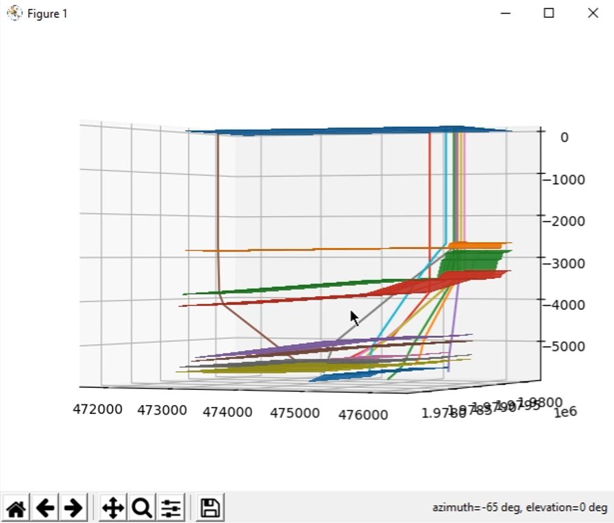

# Python 3D Plot Desktop App for Oil Drilling

This app was developet in order to create a tool for plotting 3D pipes and surfaces related to oil drilling.

In the date folder there is some SCV files you can try.

---

📫 Contact: greminoficial@gmail.com
⚡ Twitter: [@grem_dev]('https://twitter.com/grem_dev')
📌 LinkedIn: [Carmen Santiago]('https://www.linkedin.com/in/carmen-santiago-casj/')

---
